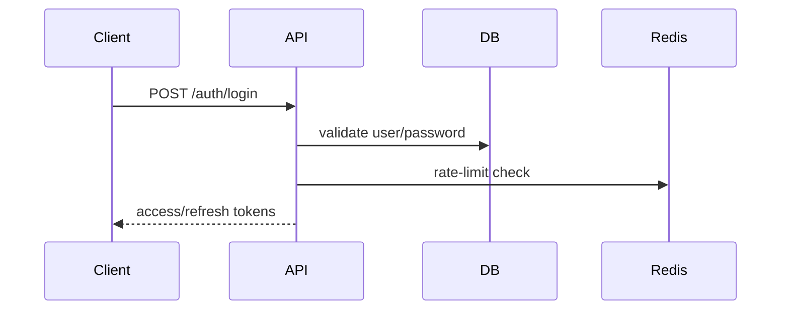
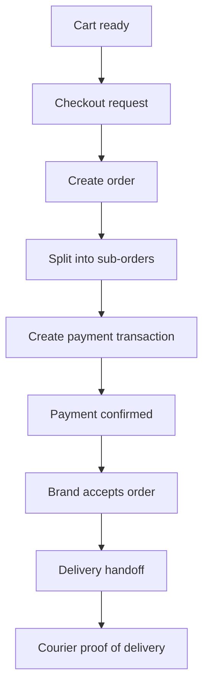
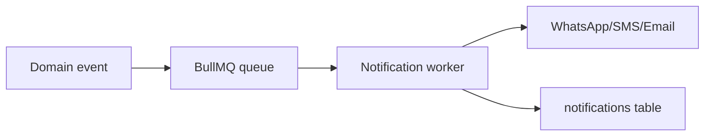

# FashionConnect Backend Architecture

## 1. Backend Architecture Overview

### 1.1 Recommended Solution Architecture

The backend should be implemented as a modular monolith using Express.js and TypeScript, backed by PostgreSQL through Prisma ORM. This choice is the most appropriate for the MVP and near-term roadmap because:

- the domain is highly relational and already modeled in PostgreSQL;
- the business workflows span authentication, catalog, orders, payments, delivery, disputes, and admin governance in tightly coupled ways;
- the team is small (three backend developers), so a modular monolith minimizes operational complexity while remaining extensible;
- future evolution into services can be handled later if the platform grows.

### 1.2 Technology Stack

- Runtime: Node.js 20+
- Framework: NestJS
- Language: TypeScript
- ORM: Prisma
- Database: PostgreSQL
- Cache/Queue: Redis + BullMQ
- Real-time: Socket.IO
- Auth: JWT access token + refresh token
- Containerization: Docker + Docker Compose
- API docs: Swagger/OpenAPI
- Validation: class-validator + class-transformer (NestJS native DTOs)
- Logging: Pino + structured logs
- Testing: Jest + Supertest + Prisma test database

### 1.3 Architectural Layers

- Presentation Layer: REST API routes
- Application Layer: controllers, services, use-cases
- Domain Layer: business rules and orchestration
- Data Layer: Prisma repositories, PostgreSQL, Redis, queues
- Integration Layer: payment gateways, notification providers, file storage, delivery partner webhooks

### 1.4 Core Design Principles

- Keep business logic inside services, not controllers
- Use transactions for financial and order-changing operations
- Treat money as append-only ledger data and not as mutable balance fields
- Enforce ownership and role-based authorization centrally
- Use idempotency keys for payment and webhook operations
- Make all external calls asynchronous where safe
- Log all admin actions and financial mutations

---

## 2. Module Breakdown

### 2.1 Authentication & Identity

#### Purpose

Provide account creation, login, OTP verification, token refresh, and session invalidation.

#### Business Description

This module governs user registration, authentication, identity verification, and session management. It must support end-users, brands, delivery companies, couriers, admins, and sub-admins.

#### Related Tables

- users
- refresh_tokens
- otp_codes
- user_permissions
- permissions

#### Dependencies

- Password hashing utility
- JWT service
- OTP provider (SMS gateway)
- Redis for rate limiting and token blacklist

#### Permissions

- Public endpoints: register, login, OTP send, OTP verify, refresh token
- Protected endpoints: logout, profile lookup, password change

#### Business Rules

- Passwords must never be stored in plaintext.
- OTPs must expire and be single-use.
- Refresh tokens are revocable and device-scoped.
- Authentication should support role-aware claims in the JWT.

---

### 2.2 Users & Profiles

#### Purpose

Manage authenticated user identity and profile-related actions.

#### Business Description

Users can manage basic profile information, addresses, and account preferences.

#### Related Tables

- users
- addresses

#### Dependencies

- Auth module
- Upload module

#### Permissions

- Self-service for end-users and brand owners
- Admin can read user profiles

#### Business Rules

- Users may have multiple addresses, but only one default address.
- Profile updates must not change role or account ownership data.

---

### 2.3 Brands & Verification

#### Purpose

Support brand registration, document submission, verification workflow, and public brand profile access.

#### Business Description

Brands onboard to the marketplace, submit KYC documents, and move through the verification tiers. Approved brands gain access to catalog and order-management features.

#### Related Tables

- brands
- brand_documents
- brand_social_links
- brand_followers

#### Dependencies

- Upload module
- Notification module
- Admin moderation workflow

#### Permissions

- Brand owners: manage own brand and docs
- Admin: verify/reject/suspend brand
- Public: read approved brand profiles

#### Business Rules

- Verification tier transitions are governed by admin approval.
- Trusted brands receive enhanced privileges and ranking benefits.
- Brand documents are reviewable and auditable.

---

### 2.4 Catalog & Products

#### Purpose

Enable products, categories, variants, images, and soft-deletion behavior.

#### Business Description

Brands manage categories and products, including variants, stock, and pricing. Public catalog endpoints should be available without authentication.

#### Related Tables

- categories
- products
- product_media
- variants
- wishlists
- discounts
- product_discounts

#### Dependencies

- Brands module
- Upload module
- Notification module

#### Permissions

- Brand owners: CRUD on own catalog
- Admin: view and moderate catalog content
- Public: browse and view products

#### Business Rules

- Product deletion is soft-delete via is_active.
- Category deletion must be soft-delete or reassign references.
- Variant uniqueness is enforced by (product_id, color, size).

---

### 2.5 Cart & Checkout

#### Purpose

Allow end-users to build a cart and convert it into an order.

#### Business Description

The cart is stored per user. At checkout, a multi-brand cart is split into sub-orders, one per brand, and a checkout-level order is created.

#### Related Tables

- carts
- cart_items
- orders
- sub_orders
- order_items
- discounts
- discount_usages

#### Dependencies

- Auth module
- Products/variants
- Payments module
- Delivery pricing logic

#### Permissions

- End-user only for own cart and checkout
- Admin can view but not modify checkout data except for support cases

#### Business Rules

- Cart items must reference available and active variants.
- Checkout must be atomic.
- Payment method can be COD or digital methods.

---

### 2.6 Orders & Fulfillment

#### Purpose

Support order lifecycle management, sub-order handling, acceptance, rejection, handoff, and delivery status.

#### Business Description

Orders are created at checkout and split into sub-orders per brand. Brands manage acceptance and handoff. Delivery partners and couriers execute delivery.

#### Related Tables

- orders
- sub_orders
- sub_order_status_history
- order_items
- returns
- delivery_proofs
- cod_reconciliations

#### Dependencies

- Cart/checkout module
- Delivery module
- Payments module
- Notifications module

#### Permissions

- End-user: view own orders
- Brand: manage own sub-orders
- Delivery company/courier: access assigned sub-orders
- Admin: observe and intervene

#### Business Rules

- Status changes must be appended to history.
- Delivery proof is required for delivered state.
- Rejection, cancellation, and return flows must be auditable.

---

### 2.7 Delivery & Courier Operations

#### Purpose

Allow delivery companies and couriers to receive, assign, track, and reconcile deliveries.

#### Business Description

The delivery module handles fee tiers, coverage zones, courier assignment, proof of delivery, and COD reconciliation.

#### Related Tables

- delivery_companies
- delivery_zones
- couriers
- delivery_proofs
- cod_reconciliations

#### Dependencies

- Orders & sub-orders
- Notifications
- Payments/ledger

#### Permissions

- Delivery company: manage own fleet and zones
- Courier: manage assigned orders
- Admin: oversee delivery partners

#### Business Rules

- COD reconciliation must be auditable and linked to sub-orders.
- Delivery proofs must be stored with evidence.

---

### 2.8 Payments, Payouts & Wallets

#### Purpose

Handle payment intent creation, gateway callbacks, payout approval, and wallet-ledger operations.

#### Business Description

The payment layer supports Stripe, Paymob, wallets, COD, Fawry, and installment methods. All money movement must be recorded in append-only ledger tables.

#### Related Tables

- transactions
- payouts
- wallets
- wallet_transactions
- loyalty_points
- referrals

#### Dependencies

- Orders module
- Notifications module
- Admin workflow

#### Permissions

- End-user: view own payment and wallet history
- Brand: view payout history
- Admin: approve payouts and review transactions

#### Business Rules

- Payment state changes must be idempotent.
- Wallets and brand balances are derived from ledger rows, not authoritative sources.
- Payout approval must be logged.

---

### 2.9 Reviews & Reputation

#### Purpose

Collect product and brand reviews and use them in trust and ranking systems.

#### Business Description

Users submit product or brand reviews. Reviews feed ranking and vendor scorecards.

#### Related Tables

- reviews
- review_images

#### Dependencies

- Orders module
- Products/brands

#### Permissions

- End-user: create reviews for completed purchases
- Admin: moderate reviews

#### Business Rules

- Reviews should be tied to verified purchases where possible.
- Reviews cannot be submitted for invalid or non-completed orders.

---

### 2.10 Chat & Messaging

#### Purpose

Enable real-time messaging between users and brands.

#### Business Description

A chat thread is created per end-user and brand, supporting messages, flagging, and moderation.

#### Related Tables

- chat_threads
- chat_messages

#### Dependencies

- Auth module
- Notifications module
- Socket.IO

#### Permissions

- End-users and brands: access own threads
- Admin: review flagged content

#### Business Rules

- Messages may be flagged for moderation.
- Thread ownership is tied to the user and brand involved.

---

### 2.11 Notifications

#### Purpose

Deliver transactional and operational notifications to users.

#### Business Description

Notifications are created for order, payment, delivery, chat, pricing, and account events. The system should support WhatsApp, SMS, email, and push channels.

#### Related Tables

- notification_templates
- notifications

#### Dependencies

- Events and jobs system
- Messaging providers

#### Permissions

- Authenticated user: read and mark own notifications
- Admin: trigger or review system notifications

#### Business Rules

- Notification templates are channel-specific and localized.
- Notification delivery is asynchronous.

---

### 2.12 Advertising & Ranking

#### Purpose

Support ad packages, campaigns, and precomputed ranking scores.

#### Business Description

Brands can purchase ad packages and generate ranking impact. Ranking scores are precomputed by background jobs rather than calculated live.

#### Related Tables

- ad_packages
- ad_campaigns
- ranking_scores

#### Dependencies

- Brands module
- Admin module
- Background job service

#### Permissions

- Brand: launch campaigns for own brand
- Admin: manage packages and override ranking

#### Business Rules

- Ranking should be precomputed nightly.
- Manual ranking overrides must be audit logged.

---

### 2.13 Trust, Safety & Admin Governance

#### Purpose

Support dispute handling, moderation, and admin audit logging.

#### Business Description

The admin and trust module handles disputes, moderation flags, user safety, and audit logging for platform-sensitive actions.

#### Related Tables

- disputes
- dispute_evidence
- moderation_flags
- admin_audit_log

#### Dependencies

- Orders, chat, products, admin auth

#### Permissions

- Admin and scoped sub-admins

#### Business Rules

- All admin actions must be logged.
- Disputes can be linked to order, chat, or product events.

---

## 6. Authorization Model

### 6.1 Role-Based Access Rules

- end_user: self-service access to own cart, checkout, profile, orders, reviews, wishlist, chat
- brand: access to own brand profile, own catalog, own sub-orders, own payouts, own ad campaigns
- admin: platform-wide read/write for trust, payouts, disputes, moderation, reports, ranking
- sub_admin: scoped access based on assigned permissions
- delivery_company: access to own company’s orders, couriers, zones, and reconciliation
- courier: access only to assigned orders and proof submission

### 6.2 Ownership Rules

- Users can only access their own cart, orders, addresses, wallet, and notifications.
- Brands can only manage their own catalog and orders.
- Delivery companies can only manage their own fleet and orders.
- Admin actions must be logged and scoped.

### 6.3 Permission Rules

- Permissions are stored in permissions and user_permissions.
- The application should resolve permissions via middleware that checks the JWT role and permission claims.

---

## 8. Workflow Design

### 8.1 Authentication Flow



### 8.2 Checkout and Order Lifecycle



### 8.3 Notification and Messaging Flow



---

## 9. File Structure

Recommended structure is NestJS module-per-feature:
```
apps/api/src/modules/{feature}/
  {feature}.module.ts
  {feature}.controller.ts
  {feature}.service.ts
  dto/
  {feature}.controller.spec.ts
```

## 13. Engineering Notes

### Missing Endpoints / Gaps to Address

- A dedicated upload metadata persistence table is recommended if file inspection and audit are needed.
- A dedicated payment provider config table is recommended for gateway credentials and provider selection.
- A dedicated support ticket table is recommended if the support workflow is part of the roadmap.
- A dedicated product inventory reservation table is recommended for high-volume inventory protection.

### Redundant or Ambiguous Endpoints

- Public brand profile and public product detail routes should be clearly separated from private management routes.
- The current schema uses one orders table and multiple sub_orders; route naming should consistently use sub-order resources when brand-specific actions are involved.

### Performance Concerns

- Product search should use full-text indexing and caching.
- Ranking score reads should come from Redis or precomputed tables.
- Notification dispatch should be asynchronous.

### Security Concerns

- Payment webhooks must be validated with provider signatures.
- JWT secrets must be rotated and stored in environment variables.
- External file storage must use signed URLs and scoped access.
- Admin actions must be logged and permission-checked.

### Scalability Improvements

- Introduce queue workers for notifications, ranking recalculation, and reports.
- Add read replicas for analytics and reporting endpoints.
- Use background jobs for heavy catalog indexing and moderation reviews.

---

## 15. Recommended Operational Setup

### Docker Compose Services

- app
- postgres
- redis
- worker
- mailhog or local SMTP relay

### Environment Variables

- DATABASE_URL
- REDIS_URL
- JWT_SECRET
- JWT_REFRESH_SECRET
- STRIPE_SECRET_KEY
- PAYMOB_SECRET
- STORAGE_BUCKET
- SMS_PROVIDER_API_KEY
- APP_PORT

---

## Authentication & Security Architecture (From /grill-me Sessions)

### 1. Login Flows
- **End-Users (Customers):** Mobile-first authentication using Phone Number + SMS OTP.
- **Internal Roles (Brands, Couriers, Admins):** Standard Email + Password authentication for corporate access.

### 2. Session Management (Stateless JWT)
- **Access Tokens:** Short-lived JWTs (e.g., 15 minutes) kept only in memory on the client.
- **Refresh Tokens:** Long-lived opaque tokens stored securely (HTTP-Only Secure Cookies for web portals, Secure Enclave/Keychain for mobile apps).

### 3. Multi-Tenant Brand Isolation
- We will utilize a strict **Prisma Client Extension (Middleware)**. If the authenticated 
eq.user.role is BRAND, the middleware will automatically intercept all database queries and forcefully inject { where: { brandId: req.user.brandId } }. This makes cross-tenant data leaks physically impossible at the ORM layer.

### 4. Abuse Prevention (Rate Limiting)
- We will implement strict **Redis-backed Rate Limiting** on the /auth/send-otp endpoints (e.g., maximum 3 requests per hour per IP Address and per Phone Number) to completely block automated SMS pumping fraud.

## Order & Fulfillment State Machine (From /grill-me Sessions)

### 1. Brand Acceptance Phase
- **Initial State:** PENDING_BRAND_APPROVAL
- **Logic:** Because a multi-brand cart splits into separate orders, each brand must explicitly accept their portion of the order within 24-48 hours. If a brand rejects it (due to inventory discrepancies), only that specific order is cancelled. The rest of the customer's cart proceeds normally.

### 2. Courier Handoff Phase
- **State Transition:** READY_FOR_PICKUP -> IN_TRANSIT
- **Logic:** Brands do not handle their own shipping. The Brand marks the package as READY_FOR_PICKUP. The Platform assigns a dedicated Courier. The state only changes to IN_TRANSIT when the Courier physically scans the package, creating an unbroken chain of custody for COD tracking.

### 3. COD Rejection & Return Flow
- **State Transition:** DELIVERY_FAILED -> RETURN_IN_TRANSIT -> RETURNED_TO_BRAND
- **Logic:** If a customer rejects a Cash-on-Delivery package at the door, the order enters DELIVERY_FAILED with a mandatory reason code.
- **Inventory & Ledger:** Inventory is NOT automatically restored. The item goes into RETURN_IN_TRANSIT. The physical stock is only added back to the database when the Brand confirms they have received the return. Courier penalty/payment fees are automatically settled via the LedgerTransaction table based on Platform SLA policies.

## Real-Time Chat System Architecture (From /grill-me Sessions)

### 1. Chat Thread Context
- **Strict Context Requirement:** End-users cannot freely DM brands. Every chat thread must be strictly tied to a specific ProductId (for pre-purchase support/inquiries) or an OrderId (for post-purchase support and disputes). This prevents spam and instantly gives the Brand context regarding the conversation.

### 2. Connection Scaling & Offline Fallbacks
- **Socket.io Redis Adapter:** The WebSocket layer will use the Socket.io Redis Adapter, allowing real-time events to be broadcast across multiple backend server instances as the platform scales.
- **Offline Fallback:** If a user sends a message and the recipient (Brand or Customer) is not currently connected to the WebSocket server, the backend will immediately push a job to a BullMQ queue to trigger an offline notification (SMS, Email, or Push Notification).

### 3. High-Performance Message Persistence
- **Write-Behind Caching:** Direct SQL INSERTs will not be performed for every single chat message. Instead, incoming messages are instantly written to a fast Redis List (ensuring zero latency for the user UI). A BullMQ background worker will consume this list every 5 seconds and bulk-insert the messages into PostgreSQL.